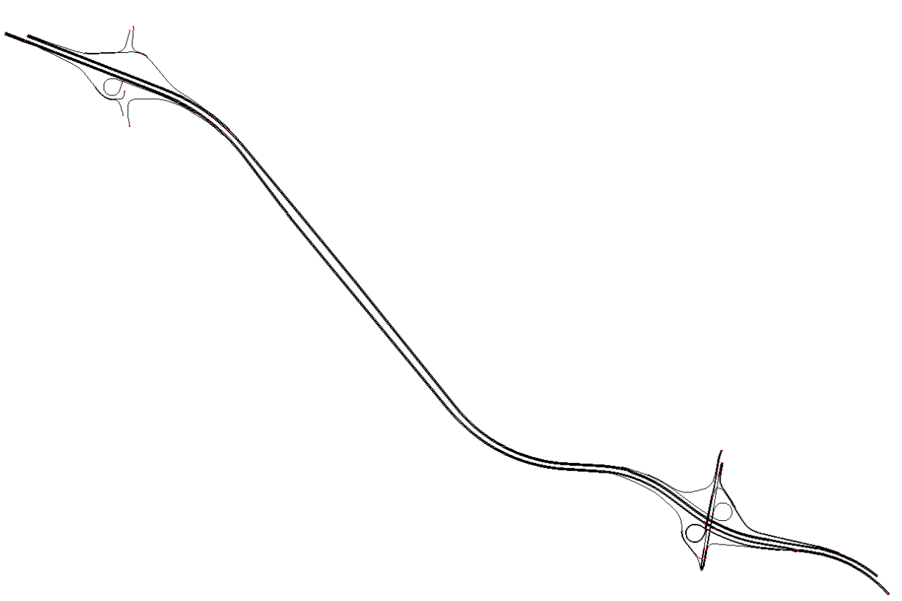
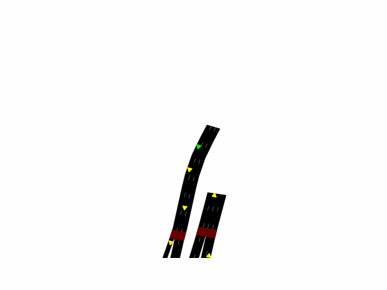

# Flow Evaluation
This is a repo for traning and evaluting the discretionary and mandatory lane change policy.

## Installation
Please refer to [README.md](flow_setup/README.md) in the `flow_setup` folder for setting up the docker and VNC viewer

## Environments
1. palo_alto

2. palo_alto_small

- [ ] palo_alto_with_attacker: Same as palo_alto, but have an attacker

## Train a policy
```bash
python3 train.py -e <env config folder name> -r <rl algo name>
```
example:
```bash
python3 train.py -e palo_alto_small -r SAC
```
For other argument options, please refer to `train_parser()` in [parser.py](utils/parser.py)

The trained NN will be stored in the `log/` folder

## Plot the training curve
```bash
python3 plot.py --eval_paths <evaluations.npz file abusolute path>
```
You can input multiple `.npz` files

## Evaluation
```bash
python3 load_trained_policy.py  -e <env config folder name> -r <rl algo name> --model_path <trained model path>
```
For other argument options, please refer to `load_parser()` in [parser.py](utils/parser.py).

## Generate animation
During training, the sumo `fcg-output.xml` will be saved in your log directory. You can use `animation.py` to 
generate the animation.
```bash
python3 animation.py -e <env config folder name> --fcd_path <fcd-output.xml file absolute path>
```
It will generate:


During evaluation, it will save the animation as pngs in your log directory. 

To generate `.gif` from images, you can use:
```bash
ffmpeg -pattern_type glob -framerate 8 -i "timestep_*.png" sim.gif
```
Then you will have sumo-style animation:
